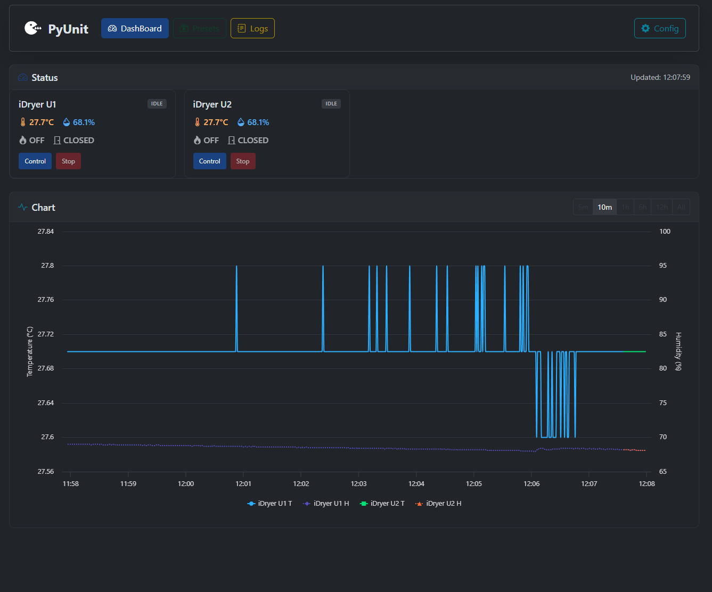
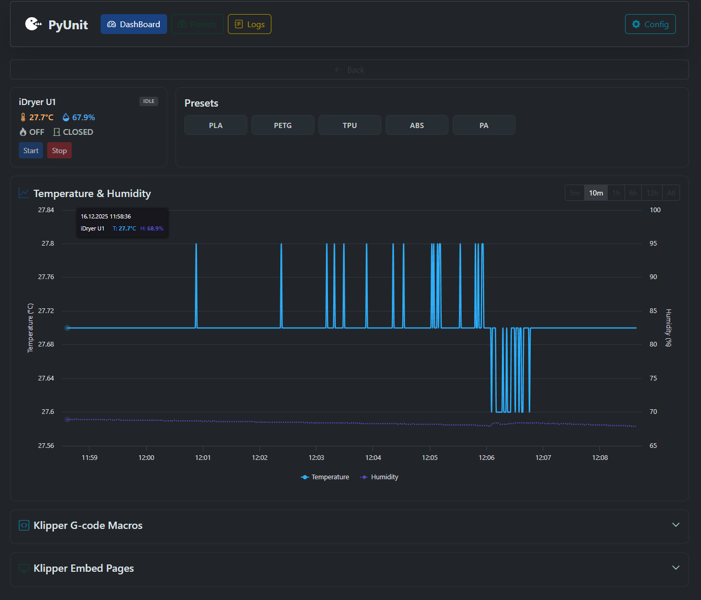
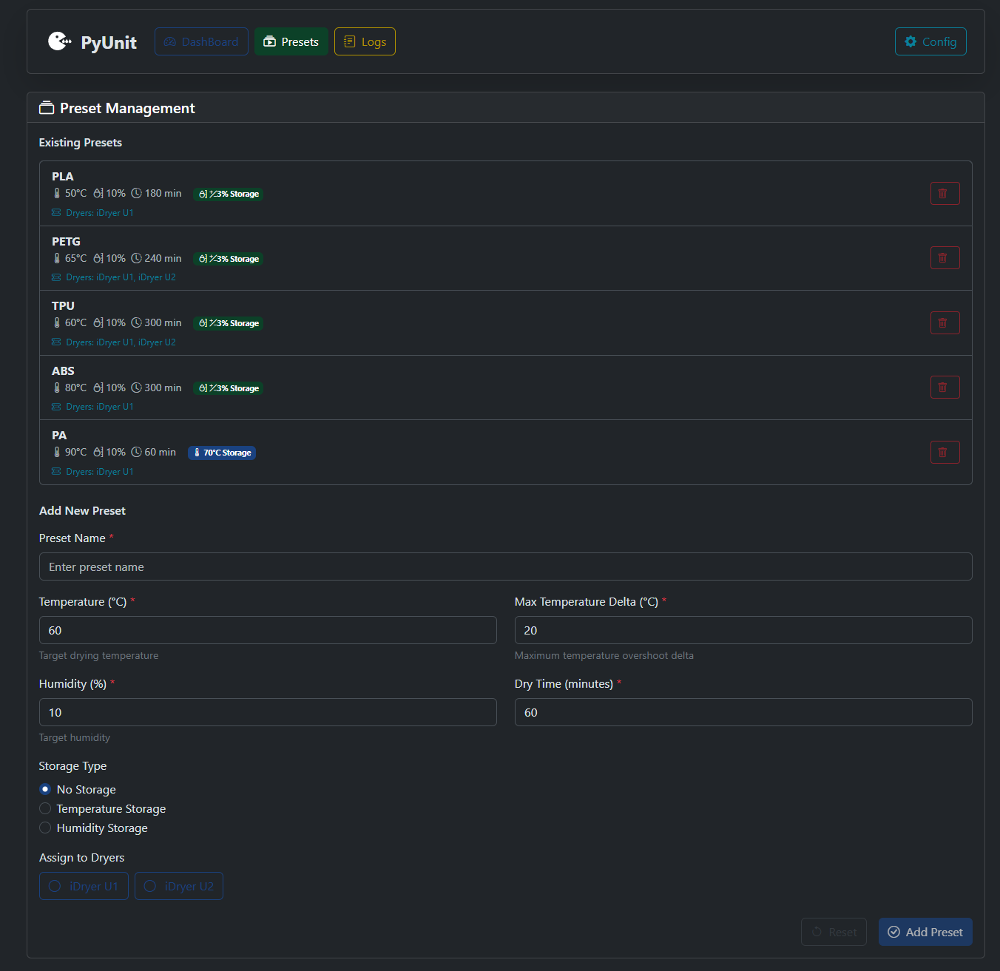
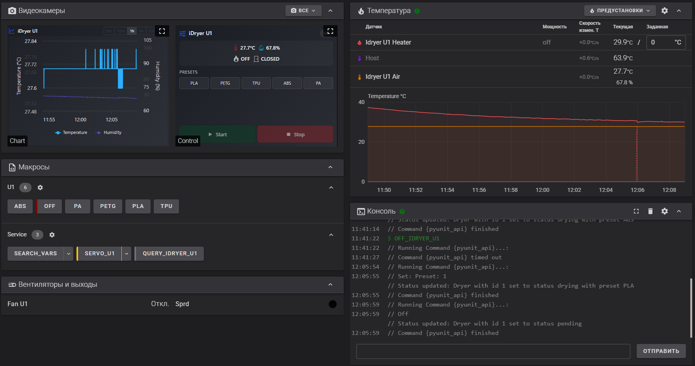

# PyUnit


PyUnit is a custom firmware for [iDryer Unit](https://github.com/pavluchenkor/iDryer-Unit) written in Python.


## ✨ Features

- 🌡️ **Real-time monitoring** of temperature and humidity
- 🎯 **PID temperature control** with configurable parameters
- 🔄 **Multiple drying presets** with timer and storage modes
- 📊 **Interactive charts** with adaptive downsampling
- 🔌 **Klipper integration** via Moonraker API
- 🎨 **LED control** for visual status indicators
- 🚪 **Servo control** for automated door operation
- 📱 **Responsive web interface** built with Angular
- 🔗 **WebSocket real-time updates**
- 📋 **Embed pages** for Klipper HTTP camera integration
- 🤖 **G-code macro generation** for Klipper
- 🐳 **Multi-platform Docker images** (amd64, arm64, arm/v7, arm/v8)

## 📸 Screenshots

### Dashboard Overview

*Main dashboard with all dryers overview and real-time monitoring*

### Dryer Dashboard

*Detailed dryer view with temperature/humidity charts and control panel*

### Presets Management

*Preset configuration with timer and storage modes*

### Fluidd Integration

*PyUnit embedded control panel in Fluidd/Mainsail interface*

## 🚀 Quick Start

### One-Command Installation

```bash
git clone https://github.com/xatang/PyUnit.git
cd PyUnit
chmod +x run.sh
./run.sh
```

**That's it!** Access PyUnit at `http://YOUR_IP:5000`

The script will automatically:
- ✅ Install Docker and Docker Compose (if needed)
- ✅ Detect your IP address
- ✅ Configure the environment
- ✅ Download pre-built Docker image
- ✅ Start the application

**Installation time:** 1-3 minutes (no compilation required!)

### First-Time Setup Wizard

On your first visit to PyUnit, you'll be greeted by a **3-step setup wizard** that guides you through initial configuration:

#### Step 1: Configure Moonraker Connection
- Enter your Moonraker IP address
  - **For Docker users:** Use your machine's network IP (e.g., `192.168.1.100`)
  - **For local installations:** You can use `127.0.0.1`
- Default port: `7125`
- Test connection before saving

#### Step 2: Add Your First Dryer
- Configure all hardware components:
  - Heater (must be configured in Klipper)
  - Fan (PWM control)
  - Temperature and humidity sensor
  - LED indicators
  - Servo door control
- All components must be pre-configured in your Klipper configuration

#### Step 3: Start Using PyUnit
- Once configured, access the dashboard
- Monitor and control your dryer units

**Note:** The wizard can be skipped using "Skip setup for now" if you want to configure manually later.

### Requirements

- **OS:** Linux (Ubuntu, Debian, Raspbian, Armbian)
- **Architecture:** 
  - amd64 (x86_64) - Intel/AMD 64-bit
  - arm64 (aarch64) - ARM 64-bit
  - arm/v7 - ARMv7 32-bit
  - arm/v8 - ARMv8 32-bit
- **RAM:** 256MB minimum (512MB recommended)
- **Disk:** ~1GB for Docker image

#### Additionally, you can add the following commands to the Fluidd or Mainsail console filters to avoid a flood of messages during firmware operation.
```bash
SET_LED LED=[led_name] INDEX=
SET_HEATER_TEMPERATURE HEATER=[heater_name]
SET_SERVO SERVO=[servo_name]
```

### Updates

To update to the latest version:

```bash
cd PyUnit
./run.sh
```


Updates preserve your configuration and IP settings automatically.

### Uninstallation

To completely remove PyUnit (container, volumes, images, network):

```bash
cd PyUnit
chmod +x uninstall.sh
./uninstall.sh
```

This will remove:
- Docker container `pyunit`
- Docker volume `pyunit_pyunit_data` (all data will be lost!)
- Docker network `pyunit_pyunit_network`
- Docker images `xatang/pyunit:*`

**Note:** Local files (pyunit.db, logs) are NOT deleted automatically. To remove them:
```bash
rm -f pyunit.db pyunit.db-wal pyunit.db-shm app.log dryer.log
```

## 🏗️ Architecture

### Backend (FastAPI + Python 3.11)
- **FastAPI** - Modern async web framework
- **SQLAlchemy** - ORM with SQLite database
- **Alembic** - Database migrations
- **WebSockets** - Real-time bidirectional communication
- **Uvicorn** - ASGI server (hardcoded: `0.0.0.0:5000`)
- **Simple-PID** - PID controller for temperature regulation
- **aiohttp** - Async HTTP client for Moonraker API

**Key Components:**
- `api/endpoints/` - Modular REST API endpoints
- `api/cruds/` - Database CRUD operations
- `api/workers/` - Background status monitoring
- `api/tools/` - Dryer control & Moonraker integration
- `main.py` - Application entry point (fixed host/port)

### Frontend (Angular 18)
- **Angular 18** - Standalone components architecture
- **Runtime Configuration** - IP/URLs set at container startup
- **Highcharts** - Interactive data visualization
- **Bootstrap 5** - Dark theme UI
- **RxJS** - Reactive state management
- **WebSocket** - Real-time data subscriptions

**Port Mapping:**
- Internal: Always `5000` (hardcoded in `main.py`)
- External: Configurable via `.env` `PORT` variable
- Example: `PORT=8080` maps `8080:5000` (host:container)

## ⚙️ Configuration

### Environment Variables

The `.env` file is automatically created with your detected IP:

```env
# Backend Configuration
LOG_LEVEL=INFO                    # Logging verbosity
DRYER_LOG_LEVEL=INFO              # Dryer-specific logging
CLEAR_LOGS_ON_STARTUP=True        # Clear logs on startup

# External Access (auto-configured by run.sh)
PORT=5000                         # External port (host side)
API_URL=http://192.168.1.100:5000/api  # Frontend API URL
WS_URL=ws://192.168.1.100:5000/api     # WebSocket URL
```

**Note:** `HOST=0.0.0.0` and internal `PORT=5000` are **hardcoded in `main.py`** and not configurable.

### Docker Compose

`docker-compose.yml` uses `.env` automatically:

```yaml
services:
  pyunit:
    image: xatang/pyunit:latest  # Auto-detected by run.sh
    ports:
      - "${PORT:-5000}:5000"     # External:Internal
    environment:
      - API_URL=${API_URL}       # For runtime config.js
      - WS_URL=${WS_URL}
    volumes:
      - ./pyunit.db:/app/pyunit.db
      - ./app.log:/app/app.log
      - ./dryer.log:/app/dryer.log
```

### Changing the External Port

Edit `.env`:
```env
PORT=8080
API_URL=http://192.168.1.100:8080/api
WS_URL=ws://192.168.1.100:8080/api
```

Then restart:
```bash
sudo docker compose up -d
```

## 🎮 Usage

### Dashboard

**Real-time Monitoring:**
- Live temperature and humidity charts
- Current dryer status and remaining time
- Heater and servo state indicators
- Historical data with time range selector (5m, 10m, 1h, 6h, 12h, All)

**Starting a Drying Cycle:**
1. Select a dryer from the list
2. Choose a preset
3. Click **Start** - the dryer will begin the drying process

### Configuration

**Moonraker Integration:**
1. Go to **Config** → **Moonraker**
2. Set Moonraker IP
3. Add API key (if authentication enabled)
4. Save configuration
5. Add new dryer
6. Assign presets to new dryer

### Klipper Integration

**Example Configuration:**

A complete Klipper configuration example is available in `config_and_macros/U1.cfg.example`. This file contains:
- Heater configuration (`[heater_generic]`)
- Temperature sensor setup (`[temperature_sensor]`)
- LED control (`[neopixel]`)
- Servo configuration (`[servo]`)
- G-code macros for dryer control

**⚠️ Important:** All module and sensor names in Klipper configuration **must be lowercase**:
- ✅ Correct: `idryer_u1_heater`, `idryer_u1_air`, `srv_u1`
- ❌ Wrong: `IDryer_U1_Heater`, `IDRYER_U1_AIR`, `SRV_U1`

**G-code Macros:**
1. To control the drying process via gcode macro, your printer must have the [gcode_shell_command](https://github.com/dw-0/kiauh/blob/master/docs/gcode_shell_command.md) extension installed.
2. After installation gcode_shell_command go to dryer detail page
3. Expand **Klipper G-code Macros**
4. Configure Python script path
5. Copy macros to `printer.cfg`
6. Use in Klipper:
   ```gcode
   OFF_DRYER ID=1
   PRESET_DRYER ID=1 PRESET_ID=5
   ```

**HTTP Camera Embed:**
1. Expand **Klipper Embed Pages**
2. Copy embed URLs
3. Add to Moonraker config:
   ```ini
   [camera pyunit_control]
   location: dryer
   service: http
   aspect_ratio: 4:3
   stream_url: http://192.168.1.100:5000/embed/dryer/1/control
   
   [camera pyunit_chart]
   location: dryer
   service: http  
   aspect_ratio: 4:3
   stream_url: http://192.168.1.100:5000/embed/dryer/1/chart
   ```

## 🛠️ Service Management

```bash
# View status
sudo docker compose ps

# Start/stop/restart
sudo docker compose up -d
sudo docker compose down
sudo docker compose restart

# View logs (live)
sudo docker compose logs -f

# View logs (last 100 lines)
sudo docker compose logs --tail=100

# Check resource usage
sudo docker stats pyunit
```

## 📚 API Documentation

Interactive documentation available at:
- **Swagger UI:** `http://192.168.1.100:5000/docs`
- **ReDoc:** `http://192.168.1.100:5000/redoc`

### Key Endpoints

**Dashboard:**
- `GET /api/dashboard` - Overview of all dryers
- `GET /api/dashboard/dryer/{id}` - Dryer details with chart data
- `POST /api/dashboard/dryer/{id}/preset` - Start preset on dryer
- `POST /api/dashboard/dryer/{id}/reset` - Reset dryer to pending

**Configuration:**
- `GET /api/config/dryers` - List all dryers
- `GET /api/config/moonraker` - Moonraker settings
- `PUT /api/config/moonraker` - Update Moonraker config

**Presets:**
- `GET /api/presets` - List all presets
- `POST /api/presets` - Create new preset
- `PUT /api/presets/{id}` - Update preset
- `DELETE /api/presets/{id}` - Delete preset

**Logs:**
- `GET /api/logs` - Retrieve application logs

**WebSocket:**
- `WS /api/ws` - Real-time status updates

## 📁 Project Structure

```
PyUnit/
├── .github/
│   └── workflows/
│       └── docker-build.yml     # CI/CD pipeline for multi-platform builds
├── .venv/                       # Python virtual environment (local dev)
├── __pycache__/                 # Python bytecode cache
├── alembic/                     # Database migrations
│   ├── versions/                # Migration scripts
│   │   └── 5a91b07ca6c5_initdb.py
│   ├── env.py                   # Alembic environment
│   ├── README                   # Alembic documentation
│   └── script.py.mako           # Migration template
├── api/                         # Backend API
│   ├── cruds/                   # Database CRUD operations
│   │   ├── common_crud.py       # Common operations (logs cleanup)
│   │   ├── dryer_crud.py        # Dryer management
│   │   ├── moonraker_config_crud.py  # Moonraker config
│   │   └── preset_crud.py       # Preset management
│   ├── endpoints/               # API route handlers
│   │   ├── __init__.py          # Router aggregation
│   │   ├── common.py            # Health check, WebSocket
│   │   ├── config_page.py       # Dryer & Moonraker config
│   │   ├── dashboard_page.py    # Dashboard & dryer control
│   │   ├── logs_page.py         # Logs retrieval
│   │   └── presets_page.py      # Preset CRUD
│   ├── schemas/                 # Pydantic validation models
│   │   ├── dryer_schema.py
│   │   ├── dryer_config_schema.py
│   │   ├── heater_config_schema.py
│   │   ├── humidity_config_schema.py
│   │   ├── led_config_schema.py
│   │   ├── moonraker_config_schema.py
│   │   ├── preset_schema.py
│   │   ├── servo_config_schema.py
│   │   └── temperature_config_schema.py
│   ├── tools/                   # Core control logic
│   │   ├── dryer_control.py     # Dryer state machine & PID control
│   │   └── moonraker_api.py     # Moonraker HTTP client
│   ├── workers/                 # Background tasks
│   │   └── status_worker.py     # Periodic status polling & control
│   ├── database.py              # SQLAlchemy setup & migrations
│   ├── logger.py                # Logging configuration
│   ├── models.py                # SQLAlchemy ORM models
│   └── websocket_manager.py     # WebSocket connection manager
├── config_and_macros/
│   └── idryer_api.py            # Python script for Klipper G-code integration
├── web/                         # Frontend (Angular 18)
│   ├── public/                  # Static assets
│   │   └── assets/
│   │       └── imgs/            # Images
│   ├── src/
│   │   ├── app/
│   │   │   ├── common-ui/       # Shared UI components
│   │   │   ├── pages/
│   │   │   │   ├── configs/     # Configuration pages
│   │   │   │   │   ├── dryer-config/
│   │   │   │   │   └── moonraker-config/
│   │   │   │   ├── dashboard/   # Dashboard & dryer details
│   │   │   │   │   ├── dashboard/
│   │   │   │   │   └── dryer-detail/
│   │   │   │   ├── embed/       # Klipper embed pages
│   │   │   │   │   ├── dryer-chart/
│   │   │   │   │   └── dryer-control/
│   │   │   │   ├── logs/        # Logs viewer
│   │   │   │   └── presets/     # Preset CRUD
│   │   │   │       ├── preset-editor/
│   │   │   │       └── presets-list/
│   │   │   ├── services/        # Angular services
│   │   │   │   ├── dryer-config.service.ts
│   │   │   │   ├── moonraker-config.service.ts
│   │   │   │   ├── presets.service.ts
│   │   │   │   └── websocket.service.ts
│   │   │   ├── app.config.ts    # Angular app configuration
│   │   │   ├── app.html         # Root component template
│   │   │   ├── app.initializer.ts  # Runtime config loader
│   │   │   ├── app.routes.ts    # Route definitions
│   │   │   ├── app.scss         # Global styles
│   │   │   └── app.ts           # Root component
│   │   ├── environments.ts      # Runtime config (auto-generated by update-env.js)
│   │   ├── index.html           # HTML entry point
│   │   ├── main.ts              # Bootstrap with APP_INITIALIZER
│   │   └── styles.scss          # Global SCSS styles
│   ├── angular.json             # Angular CLI configuration
│   ├── package.json             # NPM dependencies
│   ├── tsconfig.json            # TypeScript configuration
│   ├── tsconfig.app.json        # App-specific TS config
│   ├── tsconfig.spec.json       # Test TS config
│   └── update-env.js            # Pre-build script (generates environments.ts)
├── .dockerignore                # Docker build exclusions
├── .env                         # Environment config (auto-created by run.sh)
├── .gitignore                   # Git ignore patterns
├── alembic.ini                  # Alembic configuration
├── build.sh                     # Local Docker image build script
├── docker-compose.yml           # Docker Compose service definition
├── Dockerfile                   # Multi-stage Docker build (Node + Python)
├── entrypoint.sh                # Container startup script (creates config.js)
├── main.py                      # FastAPI application entry point
├── pyunit.db                    # SQLite database (created by run.sh)
├── requirements.txt             # Python dependencies
├── run.sh                       # Installation/update script
└── README.md                    # This file
```


## 🔬 Technologies

### Backend Stack
- **FastAPI** 0.104+ - Modern async web framework
- **Python** 3.11 - Programming language
- **SQLAlchemy** 2.0+ - SQL toolkit and ORM
- **Alembic** 1.12+ - Database migration tool
- **Pydantic** 2.0+ - Data validation using Python type hints
- **simple-pid** 2.0+ - PID controller implementation
- **aiohttp** 3.9+ - Async HTTP client for Moonraker
- **uvicorn** 0.24+ - ASGI server implementation
- **WebSockets** - Real-time bidirectional communication

### Frontend Stack
- **Angular** 18 - Modern web application framework
- **TypeScript** 5.0+ - Typed JavaScript superset
- **Highcharts** 11+ - Interactive charting library
- **Bootstrap** 5.3 - Responsive UI framework
- **Bootstrap Icons** 1.11+ - Icon library
- **RxJS** 7.8+ - Reactive programming library
- **Standalone Components** - Modern Angular architecture

### DevOps & Tools
- **Docker** - Containerization
- **Docker Compose** - Multi-container orchestration
- **GitHub Actions** - CI/CD automation
- **Docker Buildx** - Multi-platform image builds
- **SQLite** - Embedded database

